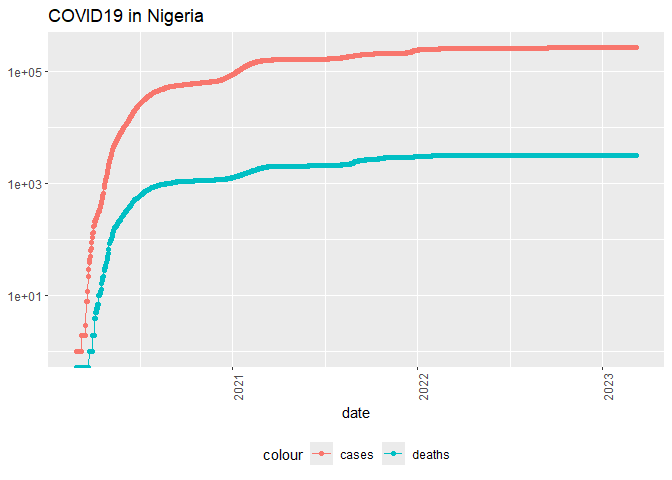
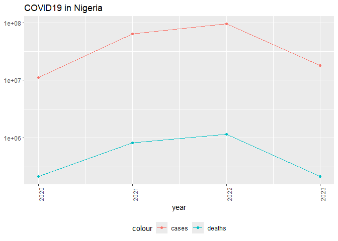
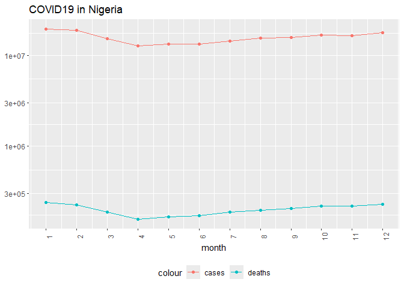
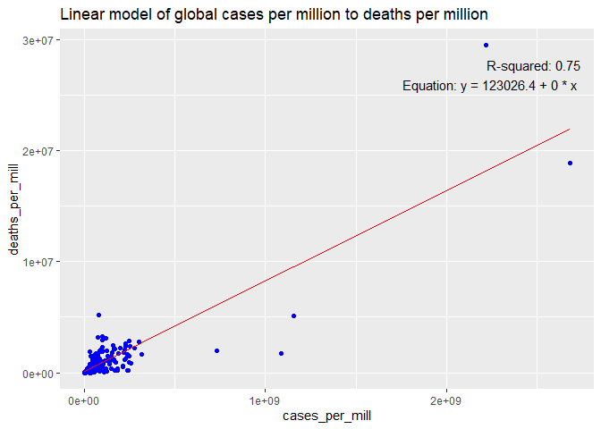
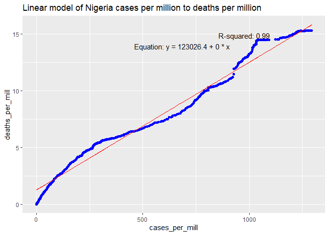

Covid-19
================
G. Ubit
2025-05-13

**About the data:** The dataset is a global COVID19 dataset gotten from
the Johns Hopkins github site found at
<https://github.com/CSSEGISandData/COVID-19/tree/master/csse_covid_19_data/csse_covid_19_time_series>

**Statement of the question of interest:** I am interested in
understanding the relationship between Covid-19 cases per million and
deaths per million globally and in Nigeria.

``` r
#Libraries used in analysis
library(stringr)
library(tidyverse)
```

    ## ── Attaching core tidyverse packages ──────────────────────── tidyverse 2.0.0 ──
    ## ✔ dplyr     1.1.4     ✔ purrr     1.0.4
    ## ✔ forcats   1.0.0     ✔ readr     2.1.5
    ## ✔ ggplot2   3.5.2     ✔ tibble    3.2.1
    ## ✔ lubridate 1.9.4     ✔ tidyr     1.3.1
    ## ── Conflicts ────────────────────────────────────────── tidyverse_conflicts() ──
    ## ✖ dplyr::filter() masks stats::filter()
    ## ✖ dplyr::lag()    masks stats::lag()
    ## ℹ Use the conflicted package (<http://conflicted.r-lib.org/>) to force all conflicts to become errors

``` r
library(dplyr)
library(ggplot2)
library(readr)
library(utils)
library(patchwork)


## Input file from the 
url_in = "https://raw.githubusercontent.com/CSSEGISandData/COVID-19/master/csse_covid_19_data/csse_covid_19_time_series/"
file_names = c("time_series_covid19_confirmed_global.csv",
"time_series_covid19_deaths_global.csv")

urls= str_c(url_in, file_names)
global_cases = read_csv(urls[1])
```

    ## Rows: 289 Columns: 1147
    ## ── Column specification ────────────────────────────────────────────────────────
    ## Delimiter: ","
    ## chr    (2): Province/State, Country/Region
    ## dbl (1145): Lat, Long, 1/22/20, 1/23/20, 1/24/20, 1/25/20, 1/26/20, 1/27/20,...
    ## 
    ## ℹ Use `spec()` to retrieve the full column specification for this data.
    ## ℹ Specify the column types or set `show_col_types = FALSE` to quiet this message.

``` r
global_death = read_csv(urls[2])
```

    ## Rows: 289 Columns: 1147
    ## ── Column specification ────────────────────────────────────────────────────────
    ## Delimiter: ","
    ## chr    (2): Province/State, Country/Region
    ## dbl (1145): Lat, Long, 1/22/20, 1/23/20, 1/24/20, 1/25/20, 1/26/20, 1/27/20,...
    ## 
    ## ℹ Use `spec()` to retrieve the full column specification for this data.
    ## ℹ Specify the column types or set `show_col_types = FALSE` to quiet this message.

``` r
# Convert global cases and death dataset to a longer format while removing Lat and Long columns
global_cases = global_cases %>% pivot_longer(cols = -c('Province/State','Country/Region',Lat, Long), names_to = "date", values_to = "cases")%>% select(-c(Lat, Long))

global_death = global_death %>% pivot_longer(cols = -c('Province/State','Country/Region', Lat, Long), names_to = "date", values_to = "deaths")%>% select(-c(Lat, Long))

#Summary of both dataset
summary(global_cases)
```

    ##  Province/State     Country/Region         date               cases          
    ##  Length:330327      Length:330327      Length:330327      Min.   :        0  
    ##  Class :character   Class :character   Class :character   1st Qu.:      680  
    ##  Mode  :character   Mode  :character   Mode  :character   Median :    14429  
    ##                                                           Mean   :   959384  
    ##                                                           3rd Qu.:   228517  
    ##                                                           Max.   :103802702

``` r
summary(global_death)
```

    ##  Province/State     Country/Region         date               deaths       
    ##  Length:330327      Length:330327      Length:330327      Min.   :      0  
    ##  Class :character   Class :character   Class :character   1st Qu.:      3  
    ##  Mode  :character   Mode  :character   Mode  :character   Median :    150  
    ##                                                           Mean   :  13380  
    ##                                                           3rd Qu.:   3032  
    ##                                                           Max.   :1123836

``` r
#Combine both dataset using a full join 
#Renaming the County/Region and Province State column to "Country_Region" & "Province_State" respectively
#Change the date column to a date Object using Ludridate function mdy()
global = global_cases %>% full_join(global_death) %>% rename(Country_Region = 'Country/Region', Province_State = 'Province/State')%>% mutate(date=mdy(date))
```

    ## Joining with `by = join_by(`Province/State`, `Country/Region`, date)`

``` r
#Summary, tail & head of data
summary(global)
```

    ##  Province_State     Country_Region          date                cases          
    ##  Length:330327      Length:330327      Min.   :2020-01-22   Min.   :        0  
    ##  Class :character   Class :character   1st Qu.:2020-11-02   1st Qu.:      680  
    ##  Mode  :character   Mode  :character   Median :2021-08-15   Median :    14429  
    ##                                        Mean   :2021-08-15   Mean   :   959384  
    ##                                        3rd Qu.:2022-05-28   3rd Qu.:   228517  
    ##                                        Max.   :2023-03-09   Max.   :103802702  
    ##      deaths       
    ##  Min.   :      0  
    ##  1st Qu.:      3  
    ##  Median :    150  
    ##  Mean   :  13380  
    ##  3rd Qu.:   3032  
    ##  Max.   :1123836

``` r
head(global, 20)
```

    ## # A tibble: 20 × 5
    ##    Province_State Country_Region date       cases deaths
    ##    <chr>          <chr>          <date>     <dbl>  <dbl>
    ##  1 <NA>           Afghanistan    2020-01-22     0      0
    ##  2 <NA>           Afghanistan    2020-01-23     0      0
    ##  3 <NA>           Afghanistan    2020-01-24     0      0
    ##  4 <NA>           Afghanistan    2020-01-25     0      0
    ##  5 <NA>           Afghanistan    2020-01-26     0      0
    ##  6 <NA>           Afghanistan    2020-01-27     0      0
    ##  7 <NA>           Afghanistan    2020-01-28     0      0
    ##  8 <NA>           Afghanistan    2020-01-29     0      0
    ##  9 <NA>           Afghanistan    2020-01-30     0      0
    ## 10 <NA>           Afghanistan    2020-01-31     0      0
    ## 11 <NA>           Afghanistan    2020-02-01     0      0
    ## 12 <NA>           Afghanistan    2020-02-02     0      0
    ## 13 <NA>           Afghanistan    2020-02-03     0      0
    ## 14 <NA>           Afghanistan    2020-02-04     0      0
    ## 15 <NA>           Afghanistan    2020-02-05     0      0
    ## 16 <NA>           Afghanistan    2020-02-06     0      0
    ## 17 <NA>           Afghanistan    2020-02-07     0      0
    ## 18 <NA>           Afghanistan    2020-02-08     0      0
    ## 19 <NA>           Afghanistan    2020-02-09     0      0
    ## 20 <NA>           Afghanistan    2020-02-10     0      0

``` r
tail(global)
```

    ## # A tibble: 6 × 5
    ##   Province_State Country_Region date        cases deaths
    ##   <chr>          <chr>          <date>      <dbl>  <dbl>
    ## 1 <NA>           Zimbabwe       2023-03-04 264127   5668
    ## 2 <NA>           Zimbabwe       2023-03-05 264127   5668
    ## 3 <NA>           Zimbabwe       2023-03-06 264127   5668
    ## 4 <NA>           Zimbabwe       2023-03-07 264127   5668
    ## 5 <NA>           Zimbabwe       2023-03-08 264276   5671
    ## 6 <NA>           Zimbabwe       2023-03-09 264276   5671

``` r
#filtering data by cases above zero.
global = global %>% filter(cases > 0) 
summary(global)
```

    ##  Province_State     Country_Region          date                cases          
    ##  Length:306827      Length:306827      Min.   :2020-01-22   Min.   :        1  
    ##  Class :character   Class :character   1st Qu.:2020-12-12   1st Qu.:     1316  
    ##  Mode  :character   Mode  :character   Median :2021-09-16   Median :    20365  
    ##                                        Mean   :2021-09-11   Mean   :  1032863  
    ##                                        3rd Qu.:2022-06-15   3rd Qu.:   271281  
    ##                                        Max.   :2023-03-09   Max.   :103802702  
    ##      deaths       
    ##  Min.   :      0  
    ##  1st Qu.:      7  
    ##  Median :    214  
    ##  Mean   :  14405  
    ##  3rd Qu.:   3665  
    ##  Max.   :1123836

``` r
#combine Province_State & Country_Region into a single column "COmbined_key" seperated by a comma
global = global %>% unite("Combined_key", c(Province_State, Country_Region), sep = ",", na.rm = TRUE, remove = FALSE)

#read in population data off the John Hopkin website while removing columns not needed
uid_lookup_url ="https://raw.githubusercontent.com/CSSEGISandData/COVID-19/master/csse_covid_19_data/UID_ISO_FIPS_LookUp_Table.csv"
uid = read_csv(uid_lookup_url) %>% select(-c(Lat, Long_, Combined_Key, code3, iso2, iso3, Admin2))
```

    ## Rows: 4321 Columns: 12
    ## ── Column specification ────────────────────────────────────────────────────────
    ## Delimiter: ","
    ## chr (7): iso2, iso3, FIPS, Admin2, Province_State, Country_Region, Combined_Key
    ## dbl (5): UID, code3, Lat, Long_, Population
    ## 
    ## ℹ Use `spec()` to retrieve the full column specification for this data.
    ## ℹ Specify the column types or set `show_col_types = FALSE` to quiet this message.

``` r
uid
```

    ## # A tibble: 4,321 × 5
    ##      UID FIPS  Province_State Country_Region      Population
    ##    <dbl> <chr> <chr>          <chr>                    <dbl>
    ##  1     4 <NA>  <NA>           Afghanistan           38928341
    ##  2     8 <NA>  <NA>           Albania                2877800
    ##  3    10 <NA>  <NA>           Antarctica                  NA
    ##  4    12 <NA>  <NA>           Algeria               43851043
    ##  5    20 <NA>  <NA>           Andorra                  77265
    ##  6    24 <NA>  <NA>           Angola                32866268
    ##  7    28 <NA>  <NA>           Antigua and Barbuda      97928
    ##  8    32 <NA>  <NA>           Argentina             45195777
    ##  9    51 <NA>  <NA>           Armenia                2963234
    ## 10    40 <NA>  <NA>           Austria                9006400
    ## # ℹ 4,311 more rows

``` r
#Conduct a left join of the global dataset with the population data
#Removing Rpovince_state and Combined_key
global_join = global %>% left_join(uid, by = c("Province_State", "Country_Region")) %>%
select(-c(UID, FIPS)) %>% select (Country_Region, date, cases, deaths, Population)

global_join
```

    ## # A tibble: 306,827 × 5
    ##    Country_Region date       cases deaths Population
    ##    <chr>          <date>     <dbl>  <dbl>      <dbl>
    ##  1 Afghanistan    2020-02-24     5      0   38928341
    ##  2 Afghanistan    2020-02-25     5      0   38928341
    ##  3 Afghanistan    2020-02-26     5      0   38928341
    ##  4 Afghanistan    2020-02-27     5      0   38928341
    ##  5 Afghanistan    2020-02-28     5      0   38928341
    ##  6 Afghanistan    2020-02-29     5      0   38928341
    ##  7 Afghanistan    2020-03-01     5      0   38928341
    ##  8 Afghanistan    2020-03-02     5      0   38928341
    ##  9 Afghanistan    2020-03-03     5      0   38928341
    ## 10 Afghanistan    2020-03-04     5      0   38928341
    ## # ℹ 306,817 more rows

``` r
#fragment the date object to get the year and month and saved to new columns
global_frag = global_join %>% mutate(year = year(date), month = month(date))

#group covid cases by countries and their cases/deaths per million population
#drop rows with NA
global_issue = global_join %>% select(-c(date)) %>% group_by(Country_Region)%>% summarize(cases=sum(cases),deaths=sum(deaths), Population = mean(Population))%>% mutate(deaths_per_mill = deaths*1000000/Population, cases_per_mill = cases*1000000/Population
)%>% select(Country_Region, cases, deaths, deaths_per_mill, cases_per_mill, Population) %>% ungroup() %>% drop_na()

#group covid cases by countries and their cases/deaths per thousand population
#filter columns to show rows with population and cases greater than 0
global_issue2 = global_issue %>% group_by(Country_Region)%>%summarize(deaths=max(deaths), cases = max(cases), population = max(Population),cases_per_thou=1000*cases/population, deaths_per_thou = 1000*deaths/population) %>% filter(cases > 0, population >0)

##10 countries with least deaths per thoudand from Covid-19
global_issue2 %>% slice_min(deaths_per_thou, n = 10)
```

    ## # A tibble: 10 × 6
    ##    Country_Region deaths    cases population cases_per_thou deaths_per_thou
    ##    <chr>           <dbl>    <dbl>      <dbl>          <dbl>           <dbl>
    ##  1 Holy See            0    26807        809     33136.              0     
    ##  2 Tuvalu              0   322901      11792     27383.              0     
    ##  3 Korea, North     1800      300   25778815         0.0116          0.0698
    ##  4 Burundi         23631 23149109   11890781      1947.              1.99  
    ##  5 Tanzania       437490 19173667   59734213       321.              7.32  
    ##  6 Niger          223237  6313963   24206636       261.              9.22  
    ##  7 Benin          118913 16903440   12123198      1394.              9.81  
    ##  8 Chad           162563  5205330   16425859       317.              9.90  
    ##  9 South Sudan    111154 11968118   11193729      1069.              9.93  
    ## 10 Bhutan           8214 22329795     771612     28939.             10.6

``` r
##0 10 countries with greater deaths per thoudand from Covid-19
global_issue2 %>% slice_max(deaths_per_thou, n = 10)
```

    ## # A tibble: 10 × 6
    ##    Country_Region       deaths   cases population cases_per_thou deaths_per_thou
    ##    <chr>                 <dbl>   <dbl>      <dbl>          <dbl>           <dbl>
    ##  1 United Kingdom       1.61e8 1.21e10   5459612.       2219621.          29459.
    ##  2 France               1.13e8 1.61e10   6001501.       2683647.          18897.
    ##  3 Peru                 1.71e8 2.50e 9  32971846          75804.           5179.
    ##  4 Netherlands          1.82e7 4.11e 9   3550314.       1157606.           5124.
    ##  5 Bulgaria             2.29e7 6.84e 8   6948445          98383.           3295.
    ##  6 Bosnia and Herzegov… 1.03e7 2.48e 8   3280815          75461.           3154.
    ##  7 Hungary              3.02e7 1.14e 9   9660350         118310.           3126.
    ##  8 North Macedonia      6.16e6 2.02e 8   2083380          97149.           2958.
    ##  9 Montenegro           1.81e6 1.53e 8    628062         244178.           2879.
    ## 10 San Marino           9.36e4 1.02e 7     33938         300120.           2759.

``` r
#Checking distribution of covid19 cases and deaths in Nigeria per from 2020 till when the data ends
Country= "Nigeria"
global_frag %>% filter(Country_Region == Country) %>% ggplot(aes(x=date, y = cases)) + geom_line(aes(color = "cases")) + geom_point(aes(color = "cases")) + geom_line(aes(y = deaths, color = "deaths")) + geom_point(aes(y = deaths, color = "deaths")) + scale_y_log10()+ theme(legend.position="bottom", axis.text.x= element_text(angle = 90)) + labs(title = str_c("COVID19 in ", Country), y=NULL)
```

    ## Warning in scale_y_log10(): log-10 transformation introduced infinite values.
    ## log-10 transformation introduced infinite values.

<!-- -->

``` r
#Summarize Nigeria data by cases/deaths per million
Nigeria_summary = global_frag %>% filter(Country_Region == Country) %>% select(-c(month, year)) %>% mutate(cases_per_mill = cases*1000000/Population,deaths_per_mill = deaths*1000000/Population)%>% select(Country_Region, date, cases, deaths, cases_per_mill, deaths_per_mill, Population)
Nigeria_summary
```

    ## # A tibble: 1,106 × 7
    ##    Country_Region date       cases deaths cases_per_mill deaths_per_mill
    ##    <chr>          <date>     <dbl>  <dbl>          <dbl>           <dbl>
    ##  1 Nigeria        2020-02-28     1      0        0.00485               0
    ##  2 Nigeria        2020-02-29     1      0        0.00485               0
    ##  3 Nigeria        2020-03-01     1      0        0.00485               0
    ##  4 Nigeria        2020-03-02     1      0        0.00485               0
    ##  5 Nigeria        2020-03-03     1      0        0.00485               0
    ##  6 Nigeria        2020-03-04     1      0        0.00485               0
    ##  7 Nigeria        2020-03-05     1      0        0.00485               0
    ##  8 Nigeria        2020-03-06     1      0        0.00485               0
    ##  9 Nigeria        2020-03-07     1      0        0.00485               0
    ## 10 Nigeria        2020-03-08     1      0        0.00485               0
    ## # ℹ 1,096 more rows
    ## # ℹ 1 more variable: Population <dbl>

``` r
#Summarize Nigeria data by yearand cases/deaths per million
Nigeria_year_summary = global_frag %>% filter(Country_Region == Country) %>% select(-c(month)) %>%
group_by(Country_Region,year) %>% summarize(cases=sum(cases),deaths=sum(deaths), Population = mean(Population))%>% mutate(cases_per_mill = cases*1000000/Population,deaths_per_mill = deaths*1000000/Population)%>% select(Country_Region, year, cases, deaths, cases_per_mill, deaths_per_mill, Population) %>% ungroup()
```

    ## `summarise()` has grouped output by 'Country_Region'. You can override using
    ## the `.groups` argument.

``` r
Nigeria_year_summary
```

    ## # A tibble: 4 × 7
    ##   Country_Region  year    cases deaths cases_per_mill deaths_per_mill Population
    ##   <chr>          <dbl>    <dbl>  <dbl>          <dbl>           <dbl>      <dbl>
    ## 1 Nigeria         2020 11232111 2.13e5         54488.           1032.  206139587
    ## 2 Nigeria         2021 64293818 8.28e5        311895.           4015.  206139587
    ## 3 Nigeria         2022 94653383 1.15e6        459171.           5566.  206139587
    ## 4 Nigeria         2023 18120812 2.15e5         87906.           1041.  206139587

``` r
#plotting totals deaths/cases per million each year in Nigeria
Nigeria_year_summary%>% ggplot(aes(x=year, y = cases)) + geom_line(aes(color = "cases")) + geom_point(aes(color = "cases")) + geom_line(aes(y = deaths, color = "deaths")) + geom_point(aes(y = deaths, color = "deaths")) + scale_y_log10()+ theme(legend.position="bottom", axis.text.x= element_text(angle = 90)) + labs(title = str_c("COVID19 in ", Country), y=NULL)
```

<!-- -->

``` r
#Summarize Nigeria data by month and cases/deaths per million
Nigeria_month_summary = global_frag %>% filter(Country_Region == Country) %>% select(-c(year)) %>%
group_by(Country_Region,month) %>% summarize(cases=sum(cases),deaths=sum(deaths), Population = mean(Population))%>% mutate(cases_per_mill = cases*1000000/Population,deaths_per_mill = deaths*1000000/Population)%>% select(Country_Region, month, cases, deaths, cases_per_mill, deaths_per_mill, Population) %>% ungroup()
```

    ## `summarise()` has grouped output by 'Country_Region'. You can override using
    ## the `.groups` argument.

``` r
Nigeria_month_summary
```

    ## # A tibble: 12 × 7
    ##    Country_Region month   cases deaths cases_per_mill deaths_per_mill Population
    ##    <chr>          <dbl>   <dbl>  <dbl>          <dbl>           <dbl>      <dbl>
    ##  1 Nigeria            1  1.94e7 238124         94061.           1155.  206139587
    ##  2 Nigeria            2  1.87e7 225539         90526.           1094.  206139587
    ##  3 Nigeria            3  1.53e7 188015         74126.            912.  206139587
    ##  4 Nigeria            4  1.26e7 156663         61175.            760.  206139587
    ##  5 Nigeria            5  1.33e7 167006         64281.            810.  206139587
    ##  6 Nigeria            6  1.32e7 171147         64178.            830.  206139587
    ##  7 Nigeria            7  1.44e7 187002         69736.            907.  206139587
    ##  8 Nigeria            8  1.53e7 197260         74416.            957.  206139587
    ##  9 Nigeria            9  1.56e7 205648         75879.            998.  206139587
    ## 10 Nigeria           10  1.66e7 219575         80576.           1065.  206139587
    ## 11 Nigeria           11  1.63e7 217955         79272.           1057.  206139587
    ## 12 Nigeria           12  1.76e7 228187         85234.           1107.  206139587

``` r
#plotting totals deaths/cases per million each month in Nigeria
Nigeria_month_summary%>% ggplot(aes(x=month, y = cases)) + geom_line(aes(color = "cases")) + geom_point(aes(color = "cases")) + geom_line(aes(y = deaths, color = "deaths")) + geom_point(aes(y = deaths, color = "deaths")) + scale_y_log10()+ theme(legend.position="bottom", axis.text.x= element_text(angle = 90)) + labs(title = str_c("COVID19 in ", Country), y=NULL) + scale_x_continuous(breaks = seq(1, 12, 1))
```

<!-- -->

``` r
#filter global issues to know total deaths per million and cases per million in Nigeria
Nigeria_issue = global_issue %>% filter(Country_Region == Country)
Nigeria_issue
```

    ## # A tibble: 1 × 6
    ##   Country_Region     cases  deaths deaths_per_mill cases_per_mill Population
    ##   <chr>              <dbl>   <dbl>           <dbl>          <dbl>      <dbl>
    ## 1 Nigeria        188300124 2402121          11653.        913459.  206139587

``` r
#Modeling your global cases per million to deaths per million using a linear model
mod1 = lm(deaths_per_mill ~ cases_per_mill , data = global_issue)
summary(mod1)
```

    ## 
    ## Call:
    ## lm(formula = deaths_per_mill ~ cases_per_mill, data = global_issue)
    ## 
    ## Residuals:
    ##      Min       1Q   Median       3Q      Max 
    ## -7218490  -174051   -79522   197615 11330012 
    ## 
    ## Coefficients:
    ##                 Estimate Std. Error t value Pr(>|t|)    
    ## (Intercept)    1.230e+05  1.002e+05   1.228    0.221    
    ## cases_per_mill 8.112e-03  3.352e-04  24.205   <2e-16 ***
    ## ---
    ## Signif. codes:  0 '***' 0.001 '**' 0.01 '*' 0.05 '.' 0.1 ' ' 1
    ## 
    ## Residual standard error: 1294000 on 192 degrees of freedom
    ## Multiple R-squared:  0.7532, Adjusted R-squared:  0.7519 
    ## F-statistic: 585.9 on 1 and 192 DF,  p-value: < 2.2e-16

``` r
#Extract R-squared and coefficients
r_squared = summary(mod1)$r.squared
coefficients = summary(mod1)$coefficients
intercept = coefficients[1, 1]
slope = coefficients[2, 1]

#Add new column into global_issue and save to new variable "global_pred"

global_pred = global_issue %>% mutate(pred=predict(mod1))

#Plot linear model along with R2 and equation
global_pred %>% ggplot() +
geom_point(aes(x=cases_per_mill, y=deaths_per_mill),color="blue") + 
geom_line(aes(x=cases_per_mill, y=pred),color="red") +labs(title = "Linear model of global cases per million to deaths per million") + annotate("text", x = Inf, y = Inf, label = paste("R-squared:", round(r_squared, 2), "\nEquation: y =", round(intercept, 1), "+", round(slope, 1), "* x"), hjust = 1.1, vjust = 2, size = 4, color = "black")
```

<!-- -->

``` r
#Modeling your Nigeria cases per million to deaths per million using a linear model
mod = lm(deaths_per_mill ~ cases_per_mill , data = Nigeria_summary)
summary(mod)
```

    ## 
    ## Call:
    ## lm(formula = deaths_per_mill ~ cases_per_mill, data = Nigeria_summary)
    ## 
    ## Residuals:
    ##     Min      1Q  Median      3Q     Max 
    ## -1.2616 -0.4499 -0.1083  0.4093  1.5352 
    ## 
    ## Coefficients:
    ##                 Estimate Std. Error t value Pr(>|t|)    
    ## (Intercept)    1.260e+00  3.908e-02   32.24   <2e-16 ***
    ## cases_per_mill 1.123e-02  4.148e-05  270.74   <2e-16 ***
    ## ---
    ## Signif. codes:  0 '***' 0.001 '**' 0.01 '*' 0.05 '.' 0.1 ' ' 1
    ## 
    ## Residual standard error: 0.6254 on 1104 degrees of freedom
    ## Multiple R-squared:  0.9852, Adjusted R-squared:  0.9851 
    ## F-statistic: 7.33e+04 on 1 and 1104 DF,  p-value: < 2.2e-16

``` r
#Extract R-squared and coefficients
r_squared1 =  summary(mod)$r.squared
coefficients1 = summary(mod)$coefficients
intercept1 = coefficients[1, 1]
slope1 = coefficients[2, 1]

#Add new column into Nigeria_issue and save to new variable "Nigeria_pred"
Nigeria_pred = Nigeria_summary %>% mutate(pred=predict(mod))

#Plot linear model along with R2 and equation
Nigeria_pred %>% ggplot() +
geom_point(aes(x=cases_per_mill, y=deaths_per_mill),color="blue") + 
geom_line(aes(x=cases_per_mill, y=pred),color="red") +labs(title = "Linear model of Nigeria cases per million to deaths per million") + annotate("text", x = Inf, y = Inf, label = paste("R-squared:", round(r_squared1, 2), "\nEquation: y =", round(intercept1, 1), "+", round(slope1, 1), "* x"), hjust = 2, vjust = 2, size = 4, color = "black")
```

<!-- -->

**Conclusion:** Given all my analysis and modelling, I have come to the
following conclusions below;-

*Nigeria Covid-19 cases and death have slightly increased cases and
deaths in January to March likely due to increased festive activity
during that period leading to more contact with population*. *There is a
nearly perfect relationship between the no of covid cases per million
and deaths per million.*

**Possible sources of Bias:** I am personally biased toward focusing the
analysis on Nigeria as I come from Nigeria. In addition, the prediction
of Covid 19 deaths in Nigeria could be more precise if other information
about the cases such as age, sex, gender, medical history e.t.c. was
available.
