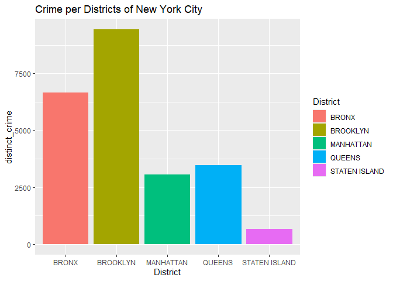
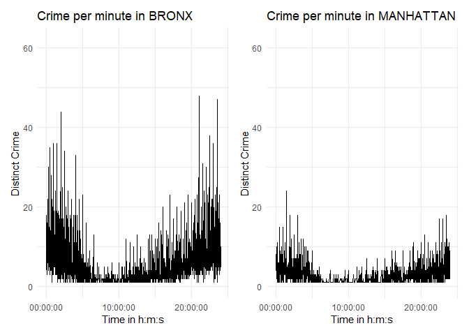
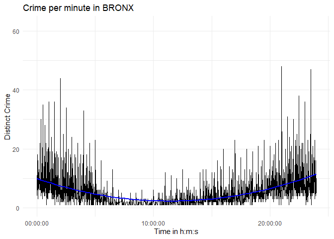
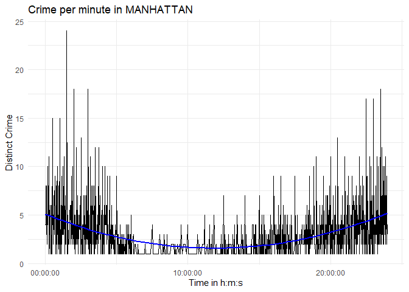

## \<\<\<\<\<\<\< HEAD

title: “NYPD” author: “G. Ubit” date: “2025-05-07” output:
github_document —

Statement of Interest: I am interested in understanding the number of
crime rate across different borough in New York City.In addition, I am
curious about the timing of these crimes particularly in Bronx.

Dataset summary: The dataset represent a breakdown of shooting incidents
in the 5 boroughs of NY city between 2006 to present. Details per
incident include event, location, time of occurrence, details of victims
and perpetrators etc. More details can be found at
<https://catalog.data.gov/dataset/nypd-shooting-incident-data-historic>

``` r
#library needed for analysis
library(lubridate)
```

    ## 
    ## Attaching package: 'lubridate'

    ## The following objects are masked from 'package:base':
    ## 
    ##     date, intersect, setdiff, union

``` r
library(tidyverse)
```

    ## ── Attaching core tidyverse packages ──────────────────────── tidyverse 2.0.0 ──
    ## ✔ dplyr   1.1.4     ✔ readr   2.1.5
    ## ✔ forcats 1.0.0     ✔ stringr 1.5.1
    ## ✔ ggplot2 3.5.2     ✔ tibble  3.2.1
    ## ✔ purrr   1.0.4     ✔ tidyr   1.3.1

    ## ── Conflicts ────────────────────────────────────────── tidyverse_conflicts() ──
    ## ✖ dplyr::filter() masks stats::filter()
    ## ✖ dplyr::lag()    masks stats::lag()
    ## ℹ Use the conflicted package (<http://conflicted.r-lib.org/>) to force all conflicts to become errors

``` r
library(tidymodels)
```

    ## ── Attaching packages ────────────────────────────────────── tidymodels 1.3.0 ──
    ## ✔ broom        1.0.8     ✔ rsample      1.3.0
    ## ✔ dials        1.4.0     ✔ tune         1.3.0
    ## ✔ infer        1.0.8     ✔ workflows    1.2.0
    ## ✔ modeldata    1.4.0     ✔ workflowsets 1.1.0
    ## ✔ parsnip      1.3.1     ✔ yardstick    1.3.2
    ## ✔ recipes      1.3.0     
    ## ── Conflicts ───────────────────────────────────────── tidymodels_conflicts() ──
    ## ✖ scales::discard() masks purrr::discard()
    ## ✖ dplyr::filter()   masks stats::filter()
    ## ✖ recipes::fixed()  masks stringr::fixed()
    ## ✖ dplyr::lag()      masks stats::lag()
    ## ✖ yardstick::spec() masks readr::spec()
    ## ✖ recipes::step()   masks stats::step()

``` r
library(dplyr)
library(ggplot2)
library(readr)
library(utils)
library(patchwork)

##importing data from the city of New York website and saving to a variable
url = "https://data.cityofnewyork.us/api/views/833y-fsy8/rows.csv?accessType=DOWNLOAD"

NYPD_main = read_csv(url)
```

    ## Rows: 29744 Columns: 21
    ## ── Column specification ────────────────────────────────────────────────────────
    ## Delimiter: ","
    ## chr  (12): OCCUR_DATE, BORO, LOC_OF_OCCUR_DESC, LOC_CLASSFCTN_DESC, LOCATION...
    ## dbl   (5): INCIDENT_KEY, PRECINCT, JURISDICTION_CODE, Latitude, Longitude
    ## num   (2): X_COORD_CD, Y_COORD_CD
    ## lgl   (1): STATISTICAL_MURDER_FLAG
    ## time  (1): OCCUR_TIME
    ## 
    ## ℹ Use `spec()` to retrieve the full column specification for this data.
    ## ℹ Specify the column types or set `show_col_types = FALSE` to quiet this message.

``` r
# Check the summary of the Data
summary(NYPD_main)
```

    ##   INCIDENT_KEY        OCCUR_DATE          OCCUR_TIME             
    ##  Min.   :  9953245   Length:29744       Min.   :00:00:00.000000  
    ##  1st Qu.: 67321140   Class :character   1st Qu.:03:30:45.000000  
    ##  Median :109291972   Mode  :character   Median :15:15:00.000000  
    ##  Mean   :133850951                      Mean   :12:46:10.874798  
    ##  3rd Qu.:214741917                      3rd Qu.:20:44:00.000000  
    ##  Max.   :299462478                      Max.   :23:59:00.000000  
    ##                                                                  
    ##      BORO           LOC_OF_OCCUR_DESC     PRECINCT      JURISDICTION_CODE
    ##  Length:29744       Length:29744       Min.   :  1.00   Min.   :0.0000   
    ##  Class :character   Class :character   1st Qu.: 44.00   1st Qu.:0.0000   
    ##  Mode  :character   Mode  :character   Median : 67.00   Median :0.0000   
    ##                                        Mean   : 65.23   Mean   :0.3181   
    ##                                        3rd Qu.: 81.00   3rd Qu.:0.0000   
    ##                                        Max.   :123.00   Max.   :2.0000   
    ##                                                         NA's   :2        
    ##  LOC_CLASSFCTN_DESC LOCATION_DESC      STATISTICAL_MURDER_FLAG
    ##  Length:29744       Length:29744       Mode :logical          
    ##  Class :character   Class :character   FALSE:23979            
    ##  Mode  :character   Mode  :character   TRUE :5765             
    ##                                                               
    ##                                                               
    ##                                                               
    ##                                                               
    ##  PERP_AGE_GROUP       PERP_SEX          PERP_RACE         VIC_AGE_GROUP     
    ##  Length:29744       Length:29744       Length:29744       Length:29744      
    ##  Class :character   Class :character   Class :character   Class :character  
    ##  Mode  :character   Mode  :character   Mode  :character   Mode  :character  
    ##                                                                             
    ##                                                                             
    ##                                                                             
    ##                                                                             
    ##    VIC_SEX            VIC_RACE           X_COORD_CD        Y_COORD_CD    
    ##  Length:29744       Length:29744       Min.   : 914928   Min.   :125757  
    ##  Class :character   Class :character   1st Qu.:1000094   1st Qu.:183042  
    ##  Mode  :character   Mode  :character   Median :1007826   Median :195506  
    ##                                        Mean   :1009442   Mean   :208722  
    ##                                        3rd Qu.:1016739   3rd Qu.:239980  
    ##                                        Max.   :1066815   Max.   :271128  
    ##                                                                          
    ##     Latitude       Longitude        Lon_Lat         
    ##  Min.   :40.51   Min.   :-74.25   Length:29744      
    ##  1st Qu.:40.67   1st Qu.:-73.94   Class :character  
    ##  Median :40.70   Median :-73.91   Mode  :character  
    ##  Mean   :40.74   Mean   :-73.91                     
    ##  3rd Qu.:40.83   3rd Qu.:-73.88                     
    ##  Max.   :40.91   Max.   :-73.70                     
    ##  NA's   :97      NA's   :97

``` r
# Retain needed columns while changing OCCUR date to a new coumn name/date object
NYPD_select = NYPD_main %>% mutate(date=mdy(OCCUR_DATE)) %>% select(c(date, OCCUR_TIME, BORO, LOC_OF_OCCUR_DESC,PERP_AGE_GROUP,PERP_AGE_GROUP, PERP_SEX,  PERP_RACE, VIC_AGE_GROUP,VIC_SEX, VIC_RACE, INCIDENT_KEY))

# OOps, seems we have some NAs in some columns - Removing more columns and renaming some of the remaining column
NYPD_select = NYPD_select %>% rename(District = BORO, Victim_Age_Group = VIC_AGE_GROUP, Victim_Sex = VIC_SEX, Victim_race=VIC_RACE, 
time = OCCUR_TIME) %>% select(-c(LOC_OF_OCCUR_DESC,PERP_AGE_GROUP,PERP_SEX,PERP_RACE))

#Sort data by date and time and row duplicate rows
NYPD_select = NYPD_select%>% arrange(date, time) %>%distinct()
NYPD_select
```

    ## # A tibble: 26,006 × 7
    ##    date       time   District  Victim_Age_Group Victim_Sex Victim_race   
    ##    <date>     <time> <chr>     <chr>            <chr>      <chr>         
    ##  1 2006-01-01 02:00  BRONX     <18              M          BLACK         
    ##  2 2006-01-01 02:22  MANHATTAN 25-44            M          BLACK         
    ##  3 2006-01-01 02:34  QUEENS    25-44            M          BLACK         
    ##  4 2006-01-01 03:30  BROOKLYN  18-24            M          BLACK         
    ##  5 2006-01-01 05:51  BRONX     18-24            M          WHITE HISPANIC
    ##  6 2006-01-01 12:30  BROOKLYN  25-44            M          BLACK         
    ##  7 2006-01-01 19:00  QUEENS    18-24            M          BLACK         
    ##  8 2006-01-02 00:49  BROOKLYN  25-44            M          BLACK         
    ##  9 2006-01-02 03:59  BROOKLYN  18-24            M          BLACK         
    ## 10 2006-01-02 03:59  BROOKLYN  25-44            M          BLACK HISPANIC
    ## # ℹ 25,996 more rows
    ## # ℹ 1 more variable: INCIDENT_KEY <dbl>

``` r
#How many district are avaliable
n_distinct(NYPD_select$District)
```

    ## [1] 5

``` r
#disctint count of victim's race per district
NYPD_select%>% group_by(District)%>%summarize(distinct_race=n_distinct(Victim_race))
```

    ## # A tibble: 5 × 2
    ##   District      distinct_race
    ##   <chr>                 <int>
    ## 1 BRONX                     7
    ## 2 BROOKLYN                  7
    ## 3 MANHATTAN                 6
    ## 4 QUEENS                    7
    ## 5 STATEN ISLAND             6

``` r
#No of crime per district and sorted using distinct crime
crime = NYPD_select%>% group_by(District)%>%summarize(distinct_crime=n_distinct(INCIDENT_KEY))%>% arrange(distinct_crime)

#No of crime per district and time
Crime_Date = NYPD_select%>% group_by(District, time)%>%summarize(distinct_crime=n_distinct(INCIDENT_KEY))
```

    ## `summarise()` has grouped output by 'District'. You can override using the
    ## `.groups` argument.

``` r
Crime_Date
```

    ## # A tibble: 5,071 × 3
    ## # Groups:   District [5]
    ##    District time   distinct_crime
    ##    <chr>    <time>          <int>
    ##  1 BRONX    00'00"              4
    ##  2 BRONX    01'00"             18
    ##  3 BRONX    02'00"             11
    ##  4 BRONX    03'00"              6
    ##  5 BRONX    04'00"              9
    ##  6 BRONX    05'00"             16
    ##  7 BRONX    06'00"              3
    ##  8 BRONX    07'00"             12
    ##  9 BRONX    08'00"              7
    ## 10 BRONX    09'00"              6
    ## # ℹ 5,061 more rows

``` r
#plot graph of total no of crime per district
crime %>% ggplot(aes(x = District, y = distinct_crime, fill=District)) +
  geom_col() +labs(title= "Crime per Districts of New York City")
```

<!-- -->

``` r
#Declare region of interest
district1 = "BRONX"
district2 = "MANHATTAN"

# Filter and plot crimes per hours in Bronx and Manhattan individually
Crime_Date %>%
  filter(District == district1) %>%
  ggplot(aes(x = time, y = distinct_crime, fill = time)) +
  geom_line() +
  coord_cartesian(ylim = c(0, max(Crime_Date$distinct_crime, na.rm = TRUE))) +
  labs(title = paste("Crime per minute in", district1), x = "Time in h:m:s", y = "Distinct Crime") +
  theme_minimal() +

Crime_Date %>%
  filter(District == district2) %>%
  ggplot(aes(x = time, y = distinct_crime, fill = time)) +
  geom_line() +
  coord_cartesian(ylim = c(0, max(Crime_Date$distinct_crime, na.rm = TRUE))) +
  labs(title = paste("Crime per minute in", district2), x = "Time in h:m:s", y = "Distinct Crime") +
  theme_minimal() +
  scale_fill_viridis_c()
```

<!-- -->

``` r
#filter data for Bronx and Manhattan and save to a variable
Bronx_crime= Crime_Date %>% filter(District == district1)
Manhattan_crime= Crime_Date %>% filter(District == district2)

# Quadratic model for district1
model_district1_quad <- lm(distinct_crime ~ poly(time, 5), Bronx_crime)
# Quadratic model for district2
model_district2_quad <- lm(distinct_crime ~ poly(time, 2), Manhattan_crime)

# Summary of the model for Bronx_crime
summary(model_district1_quad)
```

    ## 
    ## Call:
    ## lm(formula = distinct_crime ~ poly(time, 5), data = Bronx_crime)
    ## 
    ## Residuals:
    ##    Min     1Q Median     3Q    Max 
    ## -8.791 -2.520 -1.050  0.699 40.307 
    ## 
    ## Coefficients:
    ##                Estimate Std. Error t value Pr(>|t|)    
    ## (Intercept)      5.3771     0.1439  37.364  < 2e-16 ***
    ## poly(time, 5)1  12.8564     5.0697   2.536  0.01134 *  
    ## poly(time, 5)2  89.1916     5.0697  17.593  < 2e-16 ***
    ## poly(time, 5)3 -15.6690     5.0697  -3.091  0.00204 ** 
    ## poly(time, 5)4  -4.2610     5.0697  -0.840  0.40079    
    ## poly(time, 5)5   2.0382     5.0697   0.402  0.68772    
    ## ---
    ## Signif. codes:  0 '***' 0.001 '**' 0.01 '*' 0.05 '.' 0.1 ' ' 1
    ## 
    ## Residual standard error: 5.07 on 1235 degrees of freedom
    ## Multiple R-squared:  0.209,  Adjusted R-squared:  0.2058 
    ## F-statistic: 65.27 on 5 and 1235 DF,  p-value: < 2.2e-16

``` r
# Summary of the model for Manhattan_crime
summary(model_district2_quad)
```

    ## 
    ## Call:
    ## lm(formula = distinct_crime ~ poly(time, 2), data = Manhattan_crime)
    ## 
    ## Residuals:
    ##     Min      1Q  Median      3Q     Max 
    ## -3.9285 -1.3009 -0.6066  0.6814 19.7470 
    ## 
    ## Coefficients:
    ##                Estimate Std. Error t value Pr(>|t|)    
    ## (Intercept)     3.03579    0.07677  39.546   <2e-16 ***
    ## poly(time, 2)1 -0.48393    2.43484  -0.199    0.842    
    ## poly(time, 2)2 34.32543    2.43484  14.098   <2e-16 ***
    ## ---
    ## Signif. codes:  0 '***' 0.001 '**' 0.01 '*' 0.05 '.' 0.1 ' ' 1
    ## 
    ## Residual standard error: 2.435 on 1003 degrees of freedom
    ## Multiple R-squared:  0.1654, Adjusted R-squared:  0.1637 
    ## F-statistic: 99.39 on 2 and 1003 DF,  p-value: < 2.2e-16

``` r
#Add model as a column to Bronx_crime and Manhattan_crime data
Bronx_crime = Bronx_crime %>% mutate(pred = predict(model_district1_quad))
Manhattan_crime = Manhattan_crime %>% mutate(pred = predict(model_district2_quad))

# Plot for Bronx quadratic regression line
Crime_Date %>%
  filter(District == district1) %>%
  ggplot(aes(x = time, y = distinct_crime)) +
  geom_line() +
  geom_smooth(method = "lm", formula = y ~ poly(x, 2), se = FALSE, color = "blue") +
  coord_cartesian(ylim = c(0, max(Crime_Date$distinct_crime, na.rm = TRUE))) +
  labs(title = paste("Crime per minute in", district1), x = "Time in h:m:s", y = "Distinct Crime") +
  theme_minimal()
```

<!-- -->

``` r
# Plot for Manhattan with quadratic regression line

Crime_Date %>%
  filter(District == district2) %>%
  ggplot(aes(x = time, y = distinct_crime)) +
  geom_line() +
  geom_smooth(method = "lm", formula = y ~ poly(x, 2), se = FALSE, color = "blue") +
  labs(title = paste("Crime per minute in", district2), x = "Time in h:m:s", y = "Distinct Crime") +
  theme_minimal()
```

<!-- -->

\#Conclusion The data showed that crime were mostly carried in late at
night and in the early hours of the morning. In addition, Brookyln has
the highest amount of crime during the period of time under
investigation followed by Bronx, Queens, Manhattan and Staten Island. \#
Sources of Bias 1. The model is biased towards outliers. 2. There is a
lot of missing information about the perpetrators, causing inadequate
analysis on their sex, race, and age group. ======= — title: “NYPD”
author: “G. Ubit” date: “2025-05-07” output: github_document —

Statement of Interest: I am interested in understanding the number of
crime rate across different borough in New York City.In addition, I am
curious about the timing of these crimes particularly in Bronx.

Dataset summary: The dataset represent a breakdown of shooting incidents
in the 5 boroughs of NY city between 2006 to present. Details per
incident include event, location, time of occurrence, details of victims
and perpetrators etc. More details can be found at
<https://catalog.data.gov/dataset/nypd-shooting-incident-data-historic>

``` r
#library needed for analysis
library(lubridate)
library(tidyverse)
library(tidymodels)
library(dplyr)
library(ggplot2)
library(readr)
library(utils)
library(patchwork)

##importing data from the city of New York website and saving to a variable
url = "https://data.cityofnewyork.us/api/views/833y-fsy8/rows.csv?accessType=DOWNLOAD"

NYPD_main = read_csv(url)
```

    ## Rows: 29744 Columns: 21
    ## ── Column specification ────────────────────────────────────────────────────────
    ## Delimiter: ","
    ## chr  (12): OCCUR_DATE, BORO, LOC_OF_OCCUR_DESC, LOC_CLASSFCTN_DESC, LOCATION...
    ## dbl   (5): INCIDENT_KEY, PRECINCT, JURISDICTION_CODE, Latitude, Longitude
    ## num   (2): X_COORD_CD, Y_COORD_CD
    ## lgl   (1): STATISTICAL_MURDER_FLAG
    ## time  (1): OCCUR_TIME
    ## 
    ## ℹ Use `spec()` to retrieve the full column specification for this data.
    ## ℹ Specify the column types or set `show_col_types = FALSE` to quiet this message.

``` r
# Check the summary of the Data
summary(NYPD_main)
```

    ##   INCIDENT_KEY        OCCUR_DATE          OCCUR_TIME             
    ##  Min.   :  9953245   Length:29744       Min.   :00:00:00.000000  
    ##  1st Qu.: 67321140   Class :character   1st Qu.:03:30:45.000000  
    ##  Median :109291972   Mode  :character   Median :15:15:00.000000  
    ##  Mean   :133850951                      Mean   :12:46:10.874798  
    ##  3rd Qu.:214741917                      3rd Qu.:20:44:00.000000  
    ##  Max.   :299462478                      Max.   :23:59:00.000000  
    ##                                                                  
    ##      BORO           LOC_OF_OCCUR_DESC     PRECINCT      JURISDICTION_CODE
    ##  Length:29744       Length:29744       Min.   :  1.00   Min.   :0.0000   
    ##  Class :character   Class :character   1st Qu.: 44.00   1st Qu.:0.0000   
    ##  Mode  :character   Mode  :character   Median : 67.00   Median :0.0000   
    ##                                        Mean   : 65.23   Mean   :0.3181   
    ##                                        3rd Qu.: 81.00   3rd Qu.:0.0000   
    ##                                        Max.   :123.00   Max.   :2.0000   
    ##                                                         NA's   :2        
    ##  LOC_CLASSFCTN_DESC LOCATION_DESC      STATISTICAL_MURDER_FLAG
    ##  Length:29744       Length:29744       Mode :logical          
    ##  Class :character   Class :character   FALSE:23979            
    ##  Mode  :character   Mode  :character   TRUE :5765             
    ##                                                               
    ##                                                               
    ##                                                               
    ##                                                               
    ##  PERP_AGE_GROUP       PERP_SEX          PERP_RACE         VIC_AGE_GROUP     
    ##  Length:29744       Length:29744       Length:29744       Length:29744      
    ##  Class :character   Class :character   Class :character   Class :character  
    ##  Mode  :character   Mode  :character   Mode  :character   Mode  :character  
    ##                                                                             
    ##                                                                             
    ##                                                                             
    ##                                                                             
    ##    VIC_SEX            VIC_RACE           X_COORD_CD        Y_COORD_CD    
    ##  Length:29744       Length:29744       Min.   : 914928   Min.   :125757  
    ##  Class :character   Class :character   1st Qu.:1000094   1st Qu.:183042  
    ##  Mode  :character   Mode  :character   Median :1007826   Median :195506  
    ##                                        Mean   :1009442   Mean   :208722  
    ##                                        3rd Qu.:1016739   3rd Qu.:239980  
    ##                                        Max.   :1066815   Max.   :271128  
    ##                                                                          
    ##     Latitude       Longitude        Lon_Lat         
    ##  Min.   :40.51   Min.   :-74.25   Length:29744      
    ##  1st Qu.:40.67   1st Qu.:-73.94   Class :character  
    ##  Median :40.70   Median :-73.91   Mode  :character  
    ##  Mean   :40.74   Mean   :-73.91                     
    ##  3rd Qu.:40.83   3rd Qu.:-73.88                     
    ##  Max.   :40.91   Max.   :-73.70                     
    ##  NA's   :97      NA's   :97

``` r
# Retain needed columns while changing OCCUR date to a new coumn name/date object
NYPD_select = NYPD_main %>% mutate(date=mdy(OCCUR_DATE)) %>% select(c(date, OCCUR_TIME, BORO, LOC_OF_OCCUR_DESC,PERP_AGE_GROUP,PERP_AGE_GROUP, PERP_SEX,  PERP_RACE, VIC_AGE_GROUP,VIC_SEX, VIC_RACE, INCIDENT_KEY))

# OOps, seems we have some NAs in some columns - Removing more columns and renaming some of the remaining column
NYPD_select = NYPD_select %>% rename(District = BORO, Victim_Age_Group = VIC_AGE_GROUP, Victim_Sex = VIC_SEX, Victim_race=VIC_RACE, 
time = OCCUR_TIME) %>% select(-c(LOC_OF_OCCUR_DESC,PERP_AGE_GROUP,PERP_SEX,PERP_RACE))

#Sort data by date and time and row duplicate rows
NYPD_select = NYPD_select%>% arrange(date, time) %>%distinct()
NYPD_select
```

    ## # A tibble: 26,006 × 7
    ##    date       time   District  Victim_Age_Group Victim_Sex Victim_race   
    ##    <date>     <time> <chr>     <chr>            <chr>      <chr>         
    ##  1 2006-01-01 02:00  BRONX     <18              M          BLACK         
    ##  2 2006-01-01 02:22  MANHATTAN 25-44            M          BLACK         
    ##  3 2006-01-01 02:34  QUEENS    25-44            M          BLACK         
    ##  4 2006-01-01 03:30  BROOKLYN  18-24            M          BLACK         
    ##  5 2006-01-01 05:51  BRONX     18-24            M          WHITE HISPANIC
    ##  6 2006-01-01 12:30  BROOKLYN  25-44            M          BLACK         
    ##  7 2006-01-01 19:00  QUEENS    18-24            M          BLACK         
    ##  8 2006-01-02 00:49  BROOKLYN  25-44            M          BLACK         
    ##  9 2006-01-02 03:59  BROOKLYN  18-24            M          BLACK         
    ## 10 2006-01-02 03:59  BROOKLYN  25-44            M          BLACK HISPANIC
    ## # ℹ 25,996 more rows
    ## # ℹ 1 more variable: INCIDENT_KEY <dbl>

``` r
#How many district are avaliable
n_distinct(NYPD_select$District)
```

    ## [1] 5

``` r
#disctint count of victim's race per district
NYPD_select%>% group_by(District)%>%summarize(distinct_race=n_distinct(Victim_race))
```

    ## # A tibble: 5 × 2
    ##   District      distinct_race
    ##   <chr>                 <int>
    ## 1 BRONX                     7
    ## 2 BROOKLYN                  7
    ## 3 MANHATTAN                 6
    ## 4 QUEENS                    7
    ## 5 STATEN ISLAND             6

``` r
#No of crime per district and sorted using distinct crime
crime = NYPD_select%>% group_by(District)%>%summarize(distinct_crime=n_distinct(INCIDENT_KEY))%>% arrange(distinct_crime)

#No of crime per district and time
Crime_Date = NYPD_select%>% group_by(District, time)%>%summarize(distinct_crime=n_distinct(INCIDENT_KEY))
```

    ## `summarise()` has grouped output by 'District'. You can override using the
    ## `.groups` argument.

``` r
Crime_Date
```

    ## # A tibble: 5,071 × 3
    ## # Groups:   District [5]
    ##    District time   distinct_crime
    ##    <chr>    <time>          <int>
    ##  1 BRONX    00'00"              4
    ##  2 BRONX    01'00"             18
    ##  3 BRONX    02'00"             11
    ##  4 BRONX    03'00"              6
    ##  5 BRONX    04'00"              9
    ##  6 BRONX    05'00"             16
    ##  7 BRONX    06'00"              3
    ##  8 BRONX    07'00"             12
    ##  9 BRONX    08'00"              7
    ## 10 BRONX    09'00"              6
    ## # ℹ 5,061 more rows

``` r
#plot graph of total no of crime per district
crime %>% ggplot(aes(x = District, y = distinct_crime, fill=District)) +
  geom_col() +labs(title= "Crime per Districts of New York City")
```

<!-- -->

``` r
#Declare region of interest
district1 = "BRONX"
district2 = "MANHATTAN"

# Filter and plot crimes per hours in Bronx and Manhattan individually
Crime_Date %>%
  filter(District == district1) %>%
  ggplot(aes(x = time, y = distinct_crime, fill = time)) +
  geom_line() +
  coord_cartesian(ylim = c(0, max(Crime_Date$distinct_crime, na.rm = TRUE))) +
  labs(title = paste("Crime per minute in", district1), x = "Time in h:m:s", y = "Distinct Crime") +
  theme_minimal() +

Crime_Date %>%
  filter(District == district2) %>%
  ggplot(aes(x = time, y = distinct_crime, fill = time)) +
  geom_line() +
  coord_cartesian(ylim = c(0, max(Crime_Date$distinct_crime, na.rm = TRUE))) +
  labs(title = paste("Crime per minute in", district2), x = "Time in h:m:s", y = "Distinct Crime") +
  theme_minimal() +
  scale_fill_viridis_c()
```

<!-- -->

``` r
#filter data for Bronx and Manhattan and save to a variable
Bronx_crime= Crime_Date %>% filter(District == district1)
Manhattan_crime= Crime_Date %>% filter(District == district2)

# Quadratic model for district1
model_district1_quad <- lm(distinct_crime ~ poly(time, 5), Bronx_crime)
# Quadratic model for district2
model_district2_quad <- lm(distinct_crime ~ poly(time, 2), Manhattan_crime)

# Summary of the model for Bronx_crime
summary(model_district1_quad)
```

    ## 
    ## Call:
    ## lm(formula = distinct_crime ~ poly(time, 5), data = Bronx_crime)
    ## 
    ## Residuals:
    ##    Min     1Q Median     3Q    Max 
    ## -8.791 -2.520 -1.050  0.699 40.307 
    ## 
    ## Coefficients:
    ##                Estimate Std. Error t value Pr(>|t|)    
    ## (Intercept)      5.3771     0.1439  37.364  < 2e-16 ***
    ## poly(time, 5)1  12.8564     5.0697   2.536  0.01134 *  
    ## poly(time, 5)2  89.1916     5.0697  17.593  < 2e-16 ***
    ## poly(time, 5)3 -15.6690     5.0697  -3.091  0.00204 ** 
    ## poly(time, 5)4  -4.2610     5.0697  -0.840  0.40079    
    ## poly(time, 5)5   2.0382     5.0697   0.402  0.68772    
    ## ---
    ## Signif. codes:  0 '***' 0.001 '**' 0.01 '*' 0.05 '.' 0.1 ' ' 1
    ## 
    ## Residual standard error: 5.07 on 1235 degrees of freedom
    ## Multiple R-squared:  0.209,  Adjusted R-squared:  0.2058 
    ## F-statistic: 65.27 on 5 and 1235 DF,  p-value: < 2.2e-16

``` r
# Summary of the model for Manhattan_crime
summary(model_district2_quad)
```

    ## 
    ## Call:
    ## lm(formula = distinct_crime ~ poly(time, 2), data = Manhattan_crime)
    ## 
    ## Residuals:
    ##     Min      1Q  Median      3Q     Max 
    ## -3.9285 -1.3009 -0.6066  0.6814 19.7470 
    ## 
    ## Coefficients:
    ##                Estimate Std. Error t value Pr(>|t|)    
    ## (Intercept)     3.03579    0.07677  39.546   <2e-16 ***
    ## poly(time, 2)1 -0.48393    2.43484  -0.199    0.842    
    ## poly(time, 2)2 34.32543    2.43484  14.098   <2e-16 ***
    ## ---
    ## Signif. codes:  0 '***' 0.001 '**' 0.01 '*' 0.05 '.' 0.1 ' ' 1
    ## 
    ## Residual standard error: 2.435 on 1003 degrees of freedom
    ## Multiple R-squared:  0.1654, Adjusted R-squared:  0.1637 
    ## F-statistic: 99.39 on 2 and 1003 DF,  p-value: < 2.2e-16

``` r
#Add model as a column to Bronx_crime and Manhattan_crime data
Bronx_crime = Bronx_crime %>% mutate(pred = predict(model_district1_quad))
Manhattan_crime = Manhattan_crime %>% mutate(pred = predict(model_district2_quad))

# Plot for Bronx quadratic regression line
Crime_Date %>%
  filter(District == district1) %>%
  ggplot(aes(x = time, y = distinct_crime)) +
  geom_line() +
  geom_smooth(method = "lm", formula = y ~ poly(x, 2), se = FALSE, color = "blue") +
  coord_cartesian(ylim = c(0, max(Crime_Date$distinct_crime, na.rm = TRUE))) +
  labs(title = paste("Crime per minute in", district1), x = "Time in h:m:s", y = "Distinct Crime") +
  theme_minimal()
```

<!-- -->

``` r
# Plot for Manhattan with quadratic regression line

Crime_Date %>%
  filter(District == district2) %>%
  ggplot(aes(x = time, y = distinct_crime)) +
  geom_line() +
  geom_smooth(method = "lm", formula = y ~ poly(x, 2), se = FALSE, color = "blue") +
  labs(title = paste("Crime per minute in", district2), x = "Time in h:m:s", y = "Distinct Crime") +
  theme_minimal()
```

<!-- -->

\#Conclusion The data showed that crime were mostly carried in late at
night and in the early hours of the morning. In addition, Brookyln has
the highest amount of crime during the period of time under
investigation followed by Bronx, Queens, Manhattan and Staten Island. \#
Sources of Bias 1. The model is biased towards outliers. 2. There is a
lot of missing information about the perpetrators, causing inadequate
analysis on their sex, race, and age group. \>\>\>\>\>\>\>
096b965cbdc855b955c7fc66ad6baeacfc6b532a
